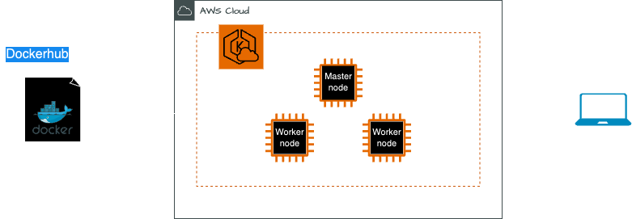

# KUBERNETES ON EKS

????

## Architecture



## Prerequisites

Before proceeding, ensure you have the following prerequisites installed:

- [Docker hub account](https://hub.docker.com/)
- [Python](https://docs.python.org/3/using/index.html)
- [Pip](https://pip.pypa.io/en/stable/installation/)

## How to run

To run the project:

1. ???

```sh
$ ??
```

## URL to public GitHub repo

https://github.com/LaraTunc/wcd-7-kubernetes

## Dockerhub Image

https://github.com/LaraTunc/wcd-7-kubernetes
